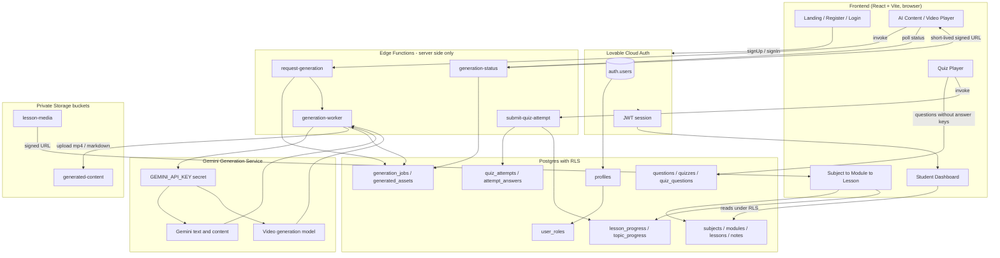

# Backend Architecture Proposal — Achievers Club KCET Prep Hub

Review only. Nothing is created or changed by this plan.

## Current state (verified)

- Frontend-only Vite + React + TS + shadcn app; no `supabase/` directory, so no backend is provisioned yet.
- `src/pages/Index.tsx` holds the whole flow: `useState<User>` receives registration data from `RegistrationForm` and swaps to `Dashboard`. Nothing persists.
- `RegistrationForm.tsx` validates name/email/phone with Zod, fakes a 1s API call, and hands data upward.
- `Dashboard.tsx` renders a hardcoded `subjects` array (topics, practiceTests, conceptNotes, weakTopics). All stats are literals.
- Routing is only `/` and `*`; TanStack Query is mounted but unused.

## Proposed architecture

React frontend -> Lovable Cloud Auth -> Postgres (RLS) -> Edge Functions -> Gemini service -> private Storage.



## Layer explanations

**Frontend.** Stays presentational. Session via `onAuthStateChange` + `getUser()`. Reads content and own progress directly through the data API (RLS enforced). Grading, secrets, and generation always go through an Edge Function. No API key ever reaches this layer.

**Auth.** Email/password + Google sign-in. `auth.users` is the identity source; a signup trigger creates a `profiles` row so registration details (name, phone, class, target rank) persist instead of living in React state. Roles live in a separate `user_roles` table read via a `has_role()` security-definer function — never a column on `profiles`.

**Database.** Content tables are student-read, admin-write. Attempt/progress tables are owner-scoped by `auth.uid()`. Correct answers and explanations live in `questions` but are never selectable by students — the quiz player reads a sanitized view/RPC and grading happens server-side.

**Edge Functions.** The only place with secrets. Four boundaries: submit-quiz-attempt (grade, write attempt, recompute progress), request-generation (validate + enqueue, admin-gated), generation-worker (call Gemini, store output), generation-status (poll job, return signed URL).

**Gemini layer.** `GEMINI_API_KEY` stored as a project secret and read with `Deno.env.get()` inside functions only. Never `VITE_`-prefixed, never in the client bundle, never echoed in a response body. Prompt templates and model IDs also stay server-side.

**Background jobs.** Video generation takes minutes, so it is async: request-generation inserts a `generation_jobs` row (`queued`) and returns a job id; the worker generates and uploads; the client polls status every 5-10s. Text/notes generation can stay synchronous in one call.

**Storage.** Two private buckets. Generated MP4/markdown is downloaded from the provider and re-uploaded immediately (provider URLs expire within the hour), then served via `createSignedUrl` — never `getPublicUrl`.

## Entity outline

```text
profiles(id -> auth.users, full_name, email, phone, class_level, target_rank, created_at)
user_roles(id, user_id, role: app_role)          -- separate table, RLS + has_role()

subjects(id, name, slug, icon, display_order)
modules(id, subject_id, name, class_level, priority, display_order)
lessons(id, module_id, title, kind: note|video|reading, body_md, media_path, display_order)

questions(id, module_id, text, options jsonb, correct_option, explanation, difficulty, source_year)
quizzes(id, module_id, title, kind: practice|chapter|mock, duration_seconds)
quiz_questions(quiz_id, question_id, position)

quiz_attempts(id, user_id, quiz_id, score, accuracy, time_taken, correct, incorrect, skipped, completed_at)
attempt_answers(id, attempt_id, question_id, selected_option, is_correct, time_spent)

lesson_progress(user_id, lesson_id, status, completed_at)
topic_progress(user_id, module_id, accuracy, attempts, avg_time, mastery_score, status)

generation_jobs(id, requested_by, module_id, kind: video|notes|questions, prompt, status, provider_job_id, error, created_at)
generated_assets(id, job_id, module_id, asset_type, storage_path, duration, metadata jsonb, created_at)
```

Every public table gets explicit GRANTs plus RLS: content readable by `authenticated`, user-scoped tables restricted to `auth.uid()`, generation tables admin-write and student-read once published.

## Service boundaries

| Concern | Path | Why |
|---|---|---|
| Browse subjects/modules/lessons | Direct data API read | Content, RLS is enough |
| Load quiz | RPC returning sanitized questions | Hides `correct_option` |
| Submit quiz | Edge Function | Grading must be trusted; also updates progress |
| Dashboard stats | View or RPC over attempts/progress | Replaces hardcoded numbers |
| Generate AI content | Edge Function + job queue | Secret handling, long-running |
| Fetch generated media | Edge Function returning signed URL | Private bucket |

## Recommended flow (registration to weak topics)

Sign up -> trigger creates `profiles` -> dashboard queries `topic_progress` + `quiz_attempts` -> student opens a module and takes a quiz -> `submit-quiz-attempt` grades, writes `quiz_attempts`/`attempt_answers`, recomputes `topic_progress` -> low-mastery modules surface as weak topics -> an admin (or scheduled job) requests Gemini generation for those Physics modules -> worker stores the asset -> student streams it via signed URL.

## Migration notes

Move the hardcoded `subjects` array out of `Dashboard.tsx` into seed rows for `subjects`/`modules`, reuse `RegistrationForm`'s Zod schema as profile validation, and add routes (`/login`, `/dashboard`, `/subjects/:slug`, `/modules/:id`, `/quiz/:id`, `/progress`) behind a protected-route wrapper.

## Next step

If you approve, the first build step would be enabling Lovable Cloud and creating auth + profiles + content schema. This review changes nothing on its own.
